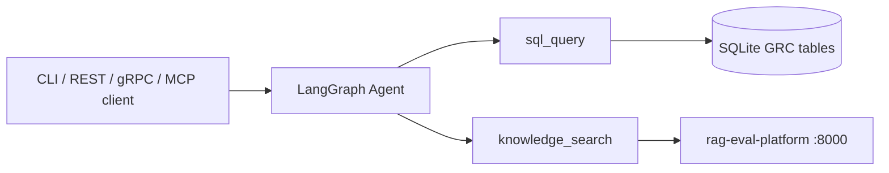

# AI Governance Operations Agent (Project 2)

LangGraph agent for **GRC analyst workflows**: regulatory Q&A (via [Project 1 RAG](../rag-eval-platform/)), compliance SQL (`ai_systems`, `compliance_findings`), and policy snippets.

> **RAG backend:** [RAG_Eval](https://github.com/laharsh/RAG_Eval) — set `RAG_API_URL` to its `/ask` endpoint.  
> **Workflows:** [docs/WORKFLOWS.md](docs/WORKFLOWS.md)  
> **Close-out:** [TODO.md](TODO.md)

---

## Stack

| Piece | Port |
|-------|------|
| P1 RAG API | 8000 |
| P2 REST `/chat` | 8001 |
| P2 gRPC | 50051 |
| MCP tools (stdio) | [docs/MCP.md](docs/MCP.md) |

Default LLM: **Groq** (reliable tool calling; Ollama optional).

---

## Quick start

```powershell
cd langgraph-agent
python -m venv .venv
.venv\Scripts\activate
pip install -r requirements.txt
copy .env.example .env

python scripts\seed_db.py
pytest tests/ -q
```

### Run with Project 1

```powershell
# Terminal 1
cd rag-eval-platform
uvicorn src.api:app --port 8000

# Terminal 2
cd langgraph-agent
python -m src.cli "How many high-risk AI systems are in our register?"
```

### REST / gRPC / benchmark

```powershell
uvicorn src.api:app --port 8001
python -m src.grpc_server
python scripts\grpc_client.py "What are the NIST AI RMF functions?"
python benchmark\run_benchmark.py --limit 3
```

---

## Phases

| Phase | Status |
|-------|--------|
| 1 Tools + governance SQLite | Done |
| 2 LangGraph + CLI | Done |
| 3 REST `/chat` + `tool_calls` | Done |
| 4 gRPC | Done |
| 5 Workflow benchmark + MCP | In progress ([TODO.md](TODO.md)) |

---

## Architecture


